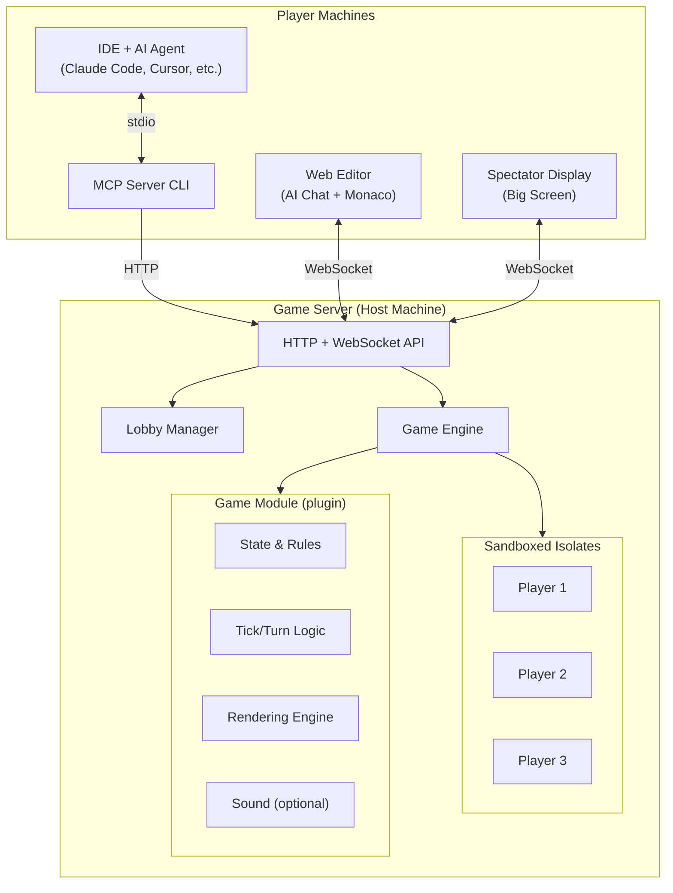

# Vibe Coding Olympics

## Overview

Vibe Coding Olympics is a multiplayer party game where players use AI coding agents to write bots that compete in a series of live games. Players sit together in a room with a shared big screen showing the action while each player works on their own machine, prompting their AI agent to write and iterate on game-playing code in real time.

The system hot-loads player code into the running game, creating a tight feedback loop: prompt your agent, watch your bot play on the big screen, iterate.

## Core Experience

A typical session looks like this:

1. The host starts the server and opens the spectator view on the big screen.
2. Players join a lobby by entering a room code. IDE users launch the MCP server CLI; others open the web editor in a browser.
3. The host selects a game (e.g. Poker) and starts it.
4. Each player's AI agent fetches the game rules and bot API docs via MCP tools (or reads them in the web editor sidebar), then writes a `play()` function.
5. Players submit code. It's sandboxed and hot-loaded into the running game within seconds.
6. The big screen shows bots playing in real time. Players watch, then prompt their agents to improve strategy.
7. When the game ends, scores are tallied. The host advances to the next game in the olympics.
8. After all games, an overall champion is crowned.

## Architecture

### Components

**Game Server** — The central process. Manages lobbies, runs game logic, executes player code in sandboxes, exposes an HTTP + WebSocket API, and serves the frontend.

**Frontend** — A single-page React app with multiple views:
- Spectator display (the big screen) — animated game rendering, scores, event feed
- Lobby — players join, host picks games, everyone sees who's connected
- Web editor — AI chat panel front and center, with a Monaco code editor available but secondary. Designed to make the game accessible to non-coders via vibe coding.
- Admin controls — start/stop games, kick players, advance the olympics

**MCP Server** — A small CLI that each IDE-connected player runs locally. Translates MCP tool calls into game server HTTP API calls. Connects to the player's AI agent via stdio transport.

**Game Modules** — Pluggable game implementations. Each module defines its own state, rules, bot API, tick/turn logic, rendering engine, and (optionally) sound. A game module is a self-contained package that owns everything about how it plays and how it looks on the big screen.

### System Diagram



### Key Flows

**Player joins via IDE:**
1. Player runs the MCP server CLI, providing a server URL and room code.
2. MCP server registers with the game server via HTTP, receives a player token.
3. The AI agent can now call MCP tools: `get_rules`, `get_game_state`, `get_api_docs`, `submit_code`.

**Player joins via web:**
1. Player opens the app in a browser and enters a room code.
2. The web editor view loads with an AI chat panel, game state panel, bot API reference, and a Monaco code editor (which may be collapsed/hidden by default).
3. Player prompts the AI in the chat panel. The AI reads the game rules and API docs, writes code, and submits it — mirroring the IDE experience but in-browser. Players can also edit code directly if they choose.

**Game loop:**
1. Host starts a game. Server initializes the game module and creates initial state.
2. The game loop ticks at a fixed interval (configurable per game, e.g. 500ms for Bomberman, per-turn for Poker).
3. Each tick: call each player's sandboxed `play()` function with their visible state, collect returned actions, advance game state, broadcast new state to all WebSocket clients.
4. Spectator display renders each new frame.
5. When the game module reports game-over, results are displayed and scores are recorded.

**Code hot-load:**
1. Player submits code via MCP tool or web editor.
2. Server compiles it in a new V8 isolate to check for syntax errors.
3. On success, the new code replaces the player's previous code and takes effect on the next tick.
4. On failure, the player receives the error message; their previous code continues running.

## Technology Stack

| Concern | Technology | Rationale |
|---------|-----------|-----------|
| Language | TypeScript (everywhere) | Shared types across server, client, MCP. Player-submitted code is JS — no FFI boundary. |
| Server framework | Fastify | Fast, good WebSocket support via `@fastify/websocket`, built-in schema validation. |
| Real-time | WebSockets (`ws`) | Low-latency state push for spectator view and tick-based games. |
| Sandboxing | `isolated-vm` | V8 isolates in-process. Fast startup, strict memory and time limits, no filesystem or network access. |
| Frontend | React + Vite | Standard tooling, fast dev server, good ecosystem. |
| Game rendering | Per-game (Pixi.js, Canvas, etc.) | Each game module owns its renderer. More work, better quality. Games may use different rendering approaches. |
| Web code editor | Monaco Editor | VS Code's editor engine. Syntax highlighting, autocomplete, familiar UX. |
| MCP SDK | `@modelcontextprotocol/sdk` | Official MCP TypeScript SDK, stdio transport for IDE integration. |
| Monorepo | npm workspaces | Simple, no extra tooling needed. |

## Project Structure

```
olympics/
├── packages/
│   ├── server/             # Fastify game server
│   │   ├── src/
│   │   │   ├── lobby/          # Room creation, player registration, auth tokens
│   │   │   ├── engine/         # Game loop, tick scheduling, sandbox orchestration
│   │   │   ├── sandbox/        # isolated-vm wrapper, code compilation, resource limits
│   │   │   └── api/            # HTTP routes + WebSocket handlers
│   │   └── package.json
│   ├── client/             # React frontend (all views)
│   │   ├── src/
│   │   │   ├── spectator/      # Big screen game rendering (Pixi.js)
│   │   │   ├── editor/         # Monaco web editor + game state panel
│   │   │   ├── lobby/          # Join/create rooms, player list
│   │   │   └── admin/          # Host controls (game selection, start/stop)
│   │   └── package.json
│   ├── mcp/                # MCP server CLI
│   │   ├── src/
│   │   │   └── index.ts        # Tool definitions, HTTP client to game server
│   │   └── package.json
│   ├── games/              # Game module plugins
│   │   ├── poker/
│   │   ├── rob-the-nest/
│   │   ├── bomberman/
│   │   └── rts/
│   └── shared/             # Shared types, constants, bot API type definitions
│       └── package.json
├── package.json            # Workspace root
└── tsconfig.base.json
```

## Game Module Interface

Every game implements this interface. The game engine is generic; all game-specific behavior lives in the module.

```typescript
interface GameModule<TState, TAction, TVisibleState, TRenderState> {
  // --- Identity ---
  name: string;
  description: string;
  minPlayers: number;
  maxPlayers: number;

  // --- Execution model ---
  // "turn-based" = one player acts at a time (poker)
  // "tick-based" = all players act simultaneously each tick (bomberman, RTS)
  mode: "turn-based" | "tick-based";

  // For tick-based games: milliseconds between ticks
  tickInterval?: number;

  // --- Lifecycle ---
  createInitialState(players: PlayerInfo[]): TState;
  isGameOver(state: TState): boolean;
  getResults(state: TState): PlayerResult[];

  // --- Execution ---
  // For turn-based games:
  executeTurn?(state: TState, playerId: string, action: TAction): TState;
  getActivePlayer?(state: TState): string;

  // For tick-based games:
  tick?(state: TState, actions: Map<string, TAction>): TState;

  // --- Visibility ---
  // What a specific player's bot sees (hides other players' hands, fog of war, etc.)
  getVisibleState(state: TState, playerId: string): TVisibleState;

  // What the spectator display sees (everything needed to render the full game)
  getSpectatorState(state: TState): TRenderState;

  // --- Documentation ---
  // Human-readable rules for AI agents to understand the game
  getRules(): string;

  // TypeScript type definitions for the bot API (state shape, valid actions)
  getBotAPI(): string;

  // --- Defaults ---
  // Action returned when player code throws, times out, or hasn't been submitted yet
  getDefaultAction(state: TState, playerId: string): TAction;

  // --- Rendering ---
  // Each game provides its own renderer as a React component (or Canvas/Pixi setup).
  // The spectator display mounts this component and passes it the spectator state.
  // This allows each game full control over its visual presentation.
  SpectatorRenderer: ComponentType<{ state: TRenderState }>;

  // --- Sound (optional) ---
  // Games may provide sound effects and music. If present, the spectator display
  // will play sounds in response to game events. Sound can be muted by the host.
  getSoundEvents?(prevState: TState, newState: TState): SoundEvent[];
}
```

## Sandbox Specification

### Player Code Contract

Players submit a single JavaScript function. The function receives the game's visible state and must return an action.

```javascript
// Player code template — same shape for every game
function play(state) {
  // 'state' is the game-specific visible state for this player
  // Return a game-specific action object
  return { action: "fold" };       // poker example
  return { action: "move", direction: "up" };  // bomberman example
}
```

### Sandbox Constraints

| Resource | Limit | Behavior on violation |
|----------|-------|----------------------|
| CPU time per invocation | 50ms | Execution terminated, default action used |
| Memory | 8 MB | Isolate terminated, default action used |
| Network access | None | Not available in isolate |
| Filesystem access | None | Not available in isolate |
| Global state | Preserved between ticks for same player | Allows bots to maintain strategy state |
| Available APIs | `Math`, `JSON`, `Array`, `Object`, `Map`, `Set`, basic JS built-ins | No `fetch`, `require`, `import`, `eval`, `Function`, `setTimeout` |

### Hot-Load Behavior

- When new code is submitted, it replaces the player's previous code starting from the next tick/turn.
- Global state accumulated by the previous code is discarded — the new code starts with a clean isolate.
- If the new code has a syntax error, the submission is rejected and the old code continues running.
- Players can submit code at any time, even mid-game. There is no limit on submission frequency (but the server may rate-limit to prevent abuse).

## MCP Server Tools

The MCP server exposes these tools to AI agents:

### `get_rules`
Returns the human-readable rules for the current game. Includes game mechanics, win conditions, and strategy hints.

**Parameters:** None
**Returns:** `{ rules: string }`

### `get_api_docs`
Returns the TypeScript type definitions for the bot API — the shape of the state object passed to `play()` and the valid action types.

**Parameters:** None
**Returns:** `{ api: string }`

### `get_game_state`
Returns the current visible game state for this player. This is the same state object that will be passed to the `play()` function.

**Parameters:** None
**Returns:** `{ state: object, gameStatus: "waiting" | "running" | "finished" }`

### `submit_code`
Submits JavaScript code to be hot-loaded into the game. The code must define a `play(state)` function.

**Parameters:** `{ code: string }`
**Returns:** `{ success: boolean, error?: string }`

### `get_game_log`
Returns recent game events relevant to this player (e.g. "You were eliminated", "You won the pot", "Your bot timed out on tick 42").

**Parameters:** `{ limit?: number }`
**Returns:** `{ events: GameEvent[] }`

### `get_standings`
Returns current scores and rankings across the olympics.

**Parameters:** None
**Returns:** `{ standings: PlayerStanding[] }`

## Game Server API

The game server exposes these HTTP and WebSocket endpoints. The MCP server, web editor, and spectator display all communicate through this API.

### HTTP Endpoints

#### Lobby
- `POST /api/rooms` — Create a room. Returns `{ roomId, hostToken }`.
- `POST /api/rooms/:roomId/join` — Join a room. Body: `{ playerName }`. Returns `{ playerId, playerToken }`.
- `GET /api/rooms/:roomId` — Get room state (players, current game, status).

#### Game Control (host only)
- `POST /api/rooms/:roomId/games/start` — Start a game. Body: `{ gameType }`.
- `POST /api/rooms/:roomId/games/stop` — Stop the current game.
- `POST /api/rooms/:roomId/advance` — Advance to the next game in the olympics schedule.

#### Player Actions
- `GET /api/rooms/:roomId/game/rules` — Get current game rules.
- `GET /api/rooms/:roomId/game/api-docs` — Get current game bot API docs.
- `GET /api/rooms/:roomId/game/state` — Get current visible game state for the authenticated player.
- `POST /api/rooms/:roomId/game/submit` — Submit player code. Body: `{ code: string }`.
- `GET /api/rooms/:roomId/game/log` — Get recent game events for the authenticated player.
- `GET /api/rooms/:roomId/standings` — Get olympics standings.

All player/host endpoints require a `Authorization: Bearer <token>` header.

### WebSocket

Connect to `ws://<host>/ws?roomId=<roomId>&token=<token>`.

**Server-sent messages:**
- `{ type: "game:state", state: <spectator state> }` — Broadcast every tick/turn. Contains the full spectator-visible state for rendering.
- `{ type: "game:event", event: <game event> }` — Notable events (eliminations, big plays, errors).
- `{ type: "game:started", gameType: string }` — A game has begun.
- `{ type: "game:ended", results: PlayerResult[] }` — A game has finished.
- `{ type: "lobby:updated", room: <room state> }` — Player joined/left, settings changed.
- `{ type: "code:accepted", playerId: string }` — Player's code was hot-loaded successfully.
- `{ type: "code:rejected", playerId: string, error: string }` — Player's code had an error.

## Olympics Scoring

An olympics session consists of multiple games played in sequence. Points are awarded based on placement in each game:

| Placement | Points |
|-----------|--------|
| 1st | 10 |
| 2nd | 7 |
| 3rd | 5 |
| 4th | 3 |
| 5th+ | 1 |

The host configures which games are in the olympics and in what order before starting the session. The overall champion is the player with the most total points after all games are played.

## Game Specifications

### Poker (Texas Hold'em)

**Mode:** Turn-based
**Players:** 2-8

Players' bots play a series of hands of no-limit Texas Hold'em. Each hand follows standard dealing and betting rounds (preflop, flop, turn, river). The game ends when only one player has chips remaining or after a configured number of hands.

**Visible state:**
```typescript
{
  hand: Card[];              // Player's hole cards
  communityCards: Card[];    // Shared cards on the table
  pot: number;
  currentBet: number;
  myChips: number;
  myCurrentBet: number;
  players: {
    id: string;
    name: string;
    chips: number;
    currentBet: number;
    folded: boolean;
    active: boolean;
  }[];
  round: "preflop" | "flop" | "turn" | "river";
  dealerIndex: number;
  isMyTurn: boolean;
}
```

**Actions:**
```typescript
{ action: "fold" }
{ action: "call" }
{ action: "raise", amount: number }
{ action: "check" }
{ action: "all_in" }
```

**Default action:** `{ action: "fold" }`

---

### Rob the Nest

**Mode:** Tick-based (500ms ticks)
**Players:** 2-6

Each player controls a team of mobs on a shared 2D grid. Each player has a "nest" containing a score. Mobs can pick up points from the center of the map or steal from other players' nests and carry them back to their own. Mobs that collide with enemy mobs near their own nest "tag" the enemy, sending them back to their spawn and dropping what they're carrying. The game runs for a fixed number of ticks.

**Visible state:**
```typescript
{
  tick: number;
  maxTicks: number;
  gridSize: { width: number; height: number };
  myNest: { x: number; y: number; score: number };
  myMobs: {
    id: string;
    x: number;
    y: number;
    carrying: number;
  }[];
  enemyNests: {
    playerId: string;
    playerName: string;
    x: number;
    y: number;
    score: number;
  }[];
  enemyMobs: {
    playerId: string;
    id: string;
    x: number;
    y: number;
    carrying: number;
  }[];
  centerPile: { x: number; y: number; remaining: number };
}
```

**Actions:**
```typescript
// Return an array of orders, one per mob
{
  orders: {
    mobId: string;
    action: "move";
    direction: "up" | "down" | "left" | "right" | "stay";
  }[];
}
```

**Default action:** All mobs stay in place.

---

### Super Bomberman

**Mode:** Tick-based (300ms ticks)
**Players:** 2-4

A grid-based arena with destructible walls. Players move and place bombs that explode in cardinal directions after a short fuse. Explosions destroy walls and eliminate players. Power-ups may appear in destroyed walls (extra bombs, longer blast range, speed boost). Last player standing wins.

**Visible state:**
```typescript
{
  tick: number;
  gridSize: { width: number; height: number };
  grid: CellType[][];          // "empty" | "wall" | "destructible" | "powerup_bombs" | "powerup_range" | "powerup_speed"
  myPosition: { x: number; y: number };
  myStats: { maxBombs: number; blastRange: number; speed: number; activeBombs: number };
  players: {
    id: string;
    name: string;
    x: number;
    y: number;
    alive: boolean;
  }[];
  bombs: {
    x: number;
    y: number;
    ownerId: string;
    fuseTicksRemaining: number;
    blastRange: number;
  }[];
  explosions: {
    x: number;
    y: number;
    ticksRemaining: number;
  }[];
}
```

**Actions:**
```typescript
{ action: "move", direction: "up" | "down" | "left" | "right" }
{ action: "bomb" }    // Place bomb at current position and stay
{ action: "stay" }    // Do nothing
```

**Default action:** `{ action: "stay" }`

---

### Simplified RTS

**Mode:** Tick-based (1000ms ticks)
**Players:** 2-4

A minimal RTS on a small grid. Each player starts with a base and a few worker units. Workers gather resources from resource nodes on the map. Resources can be spent to build more workers or fighter units. Fighters can attack enemy units and buildings. A player is eliminated when their base is destroyed. Last base standing wins.

**Unit types:**
- **Worker** — Gathers resources. Can build structures. Weak in combat.
- **Fighter** — Attacks enemy units and buildings. Cannot gather.
- **Base** — Produces units. Each player has one (non-replaceable). 100 HP.

**Visible state:**
```typescript
{
  tick: number;
  gridSize: { width: number; height: number };
  myResources: number;
  myBase: { x: number; y: number; hp: number };
  myUnits: {
    id: string;
    type: "worker" | "fighter";
    x: number;
    y: number;
    hp: number;
    carrying: number;       // resources being carried (workers only)
  }[];
  enemyBases: {
    playerId: string;
    playerName: string;
    x: number;
    y: number;
    hp: number;
  }[];
  enemyUnits: {
    playerId: string;
    id: string;
    type: "worker" | "fighter";
    x: number;
    y: number;
    hp: number;
  }[];
  resourceNodes: {
    x: number;
    y: number;
    remaining: number;
  }[];
  // Fog of war: only enemies within vision range of your units are visible
}
```

**Actions:**
```typescript
{
  unitOrders: {
    unitId: string;
    action: "move" | "attack" | "gather" | "return" | "stay";
    target?: { x: number; y: number };  // for move, attack, gather
  }[];
  baseOrder?: {
    produce: "worker" | "fighter";   // if you have enough resources
  };
}
```

**Default action:** All units stay, no production.

## Player Identity and Room Creation

Identity is kept lightweight. This is a party game, not a platform.

**Joining a room:** Ephemeral. A player picks a display name and enters a room code. No account required. The server issues a short-lived token for the session.

**Creating a room:** Two paths:
- **Web:** Requires a simple account (email + password or OAuth). This is the only action that requires an account. Prevents abuse of room creation on public-facing servers.
- **CLI:** The server can be run locally. When started from the command line, a room can be created via a CLI flag or startup prompt, no account needed. This supports the "run it on your own machine" use case.

Persistent identity features (player profiles, cross-session leaderboards, tournament brackets) are explicitly out of scope for the MVP. The server stores nothing after a session ends.

## Web Editor and AI Chat

The web editor exists to make the game accessible to people who don't have an LLM-integrated IDE set up. Its primary audience is non-coders being introduced to vibe coding.

**Layout:**
- The AI chat panel is the dominant UI element — front and center.
- The Monaco code editor is secondary. It may be collapsed or hidden by default, available for players who want to see or tweak the code directly.
- A game state panel shows the current state of the game (live-updating via WebSocket).
- The bot API reference and game rules are accessible as a sidebar or expandable section.

**AI Integration:**
- The chat panel connects to an LLM API to provide an agent-like experience in the browser.
- The AI can read the game rules and bot API docs, write a `play()` function, submit it, observe game state changes, and iterate — all through the chat interface.
- This mirrors the MCP-connected IDE experience but without requiring any local tooling setup.
- API key management: the server operator configures an LLM API key server-side. Players using the web editor don't need their own API key. This keeps the barrier to entry minimal but means the host bears the API cost.

## Replay System (Future)

Not in the MVP, but the architecture should not preclude it.

**Design considerations for future replay support:**
- The game engine should emit a log of all state transitions (tick number, actions received, resulting state delta or full state snapshot).
- Player code submissions should be recorded with timestamps, forming a history of each player's bot evolution during a game.
- This history could be stored as a lightweight append-only log per game session — conceptually similar to a git repo per room, tracking code changes and game state over time.
- Replay playback would re-feed recorded spectator states into the game's `SpectatorRenderer` component at the original tick rate.

**What this means for MVP development:**
- The game engine should structure its loop so that state transitions are observable (event emitter or similar), even if nothing is recording them yet.
- Code submissions should pass through a single codepath that could easily be wrapped with logging.
- Avoid designs that make game state reconstruction impossible (e.g. relying on non-deterministic sandbox side effects).

## Sound

Sound is a per-game-module concern. Each game module may optionally provide:
- **Sound effect triggers:** A function that compares previous and new game state and returns a list of sound events (e.g. "explosion", "card_dealt", "unit_died"). The spectator display plays corresponding audio.
- **Background music:** A game may specify a music track to loop during play.
- **Assets:** Sound files are bundled with the game module package.

The spectator display provides a global mute toggle controlled by the host. Sound is off by default and must be enabled explicitly.

## Open Questions

- **LLM provider for web editor:** Which LLM API should the web editor's AI chat use? Anthropic's Claude API is the natural choice given the MCP ecosystem, but should we support configurable providers?
- **Rate limiting:** What are sensible rate limits for code submissions? Too aggressive hurts the iterative feedback loop; too lax risks abuse.
- **Game module loading:** Should game modules be statically bundled, or dynamically loaded at runtime? Static is simpler; dynamic would allow third-party game development without rebuilding the server.
- **Spectator display scaling:** How should the spectator view handle different screen sizes and aspect ratios on the big screen?
